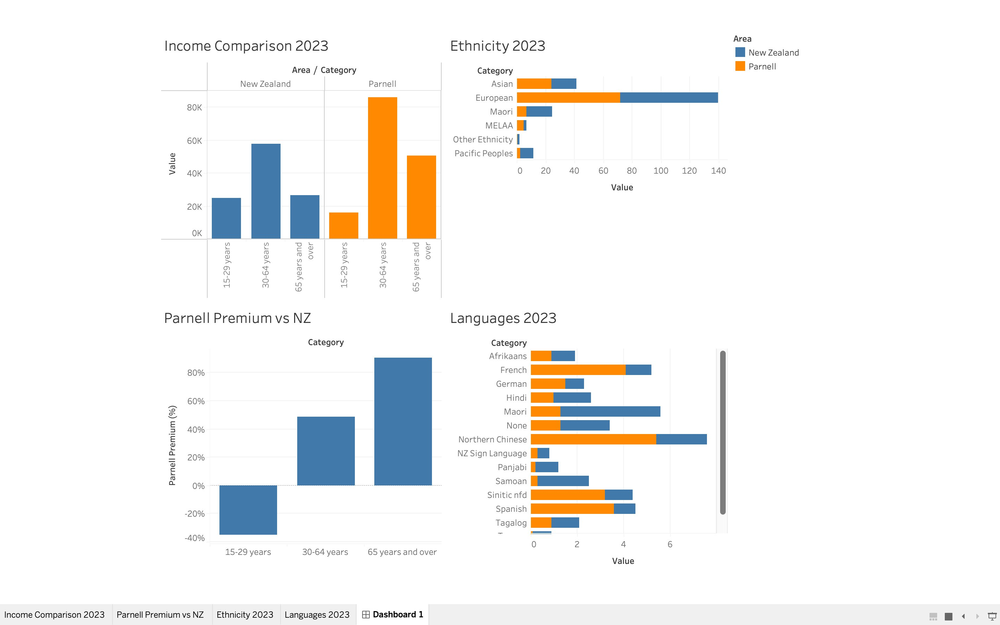

# Parnell Customer Analysis for De Kopf Hair Salon

## Overview

A data-driven customer segmentation analysis for [De Kopf](https://dekopf.co.nz/), a hair salon in Parnell, Auckland. Using publicly available Stats NZ 2023 Census data, this project identifies key demographic characteristics of the Parnell area to inform the salon's new client acquisition strategy.

**Dashboard:** [View on Tableau Public](#) *(link to be added after publishing)*

## Key Findings

### 1. Parnell is a high-income area — premium pricing is justified

Median personal income for 30–64-year-olds in Parnell is **$86,000**, compared to the national median of **$57,900** — a **+48% premium**. The 65+ age group earns nearly double the national figure ($50,700 vs $26,600, +91%). This confirms that Parnell residents have significant disposable income for premium hair services such as colour, treatments, and styling packages.

### 2. The target demographic is working professionals aged 30–64

The 30–64 age group represents the highest-income segment and makes up the largest share of Parnell's population. Notably, the 15–29 age group earns *less* than the national average ($16,200 vs $25,000), indicating Parnell is not a student area. Low-cost, youth-oriented promotions are unlikely to be effective here.

### 3. One in four Parnell residents is Asian — multilingual service is a differentiator

Asian ethnicities make up **24.3%** of Parnell's population, compared to **17.3%** nationally. This proportion has grown rapidly: from 14.5% in 2013 to 24.3% in 2023. A salon that can communicate in Asian languages has a structural advantage in this market.

### 4. Chinese-language speakers are concentrated in Parnell

Northern Chinese (Mandarin) speakers make up **5.4%** of Parnell's population — **2.5x the national average** (2.2%). Combined with Yue (Cantonese) at 2.0% and other Sinitic languages at 3.2%, Chinese-language speakers represent over **10%** of the local population. French (4.1% vs 1.1%) and Spanish (3.6% vs 0.9%) are also disproportionately represented, confirming Parnell's international character.

## Dashboard

The Tableau dashboard contains four visualisations:

| Chart | What it shows |
|-------|--------------|
| Income Comparison 2023 | Median income by age group — Parnell vs NZ national |
| Parnell Premium vs NZ | Percentage difference in income (Parnell relative to NZ) |
| Ethnicity 2023 | Ethnic composition — Parnell vs NZ national |
| Languages 2023 | Languages spoken at home — Parnell vs NZ national |

## Data

All data is sourced from **Stats NZ 2023 Census**, licensed under [Creative Commons Attribution 4.0 (CC BY 4.0)](https://creativecommons.org/licenses/by/4.0/).

Source: [Stats NZ — Parnell SA3 Area Summary](https://tools.summaries.stats.govt.nz/places/SA3/parnell)

The unified dataset used in Tableau is available in this repository: [`data/parnell_dekopf_master.csv`](data/parnell_dekopf_master.csv)

### Data structure (long format)

| Column | Description |
|--------|------------|
| Topic | Median Income / Ethnicity / Language |
| Category | Age group, ethnicity, or language name |
| Subgroup | Reserved for future use |
| Area | Parnell or New Zealand |
| Year | Census year (2013, 2018, or 2023) |
| Value | Numeric value (NZD or percentage) |
| Unit | NZD or percent |

## Recommendations

See [`insights/dekopf-recommendations.md`](insights/dekopf-recommendations.md) for actionable recommendations based on the analysis.

## Tools Used

- **SQL** — Data querying and preparation
- **Tableau Public** — Data visualisation and dashboard creation
- **Stats NZ Census 2023** — Public data source (CC BY 4.0)

## About

This project was created as part of a data analytics portfolio, demonstrating the ability to use public data to generate actionable business insights for a real New Zealand business. No confidential client data was used — all analysis is based on publicly available census data.

---

*Created by Kei Endo — 2026*
